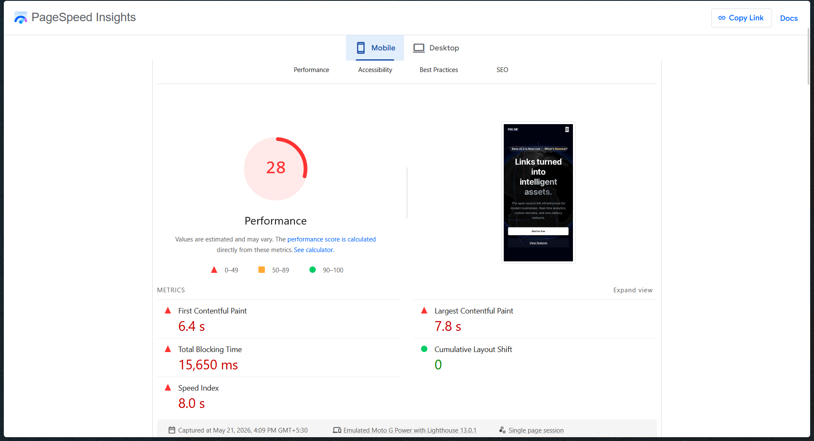
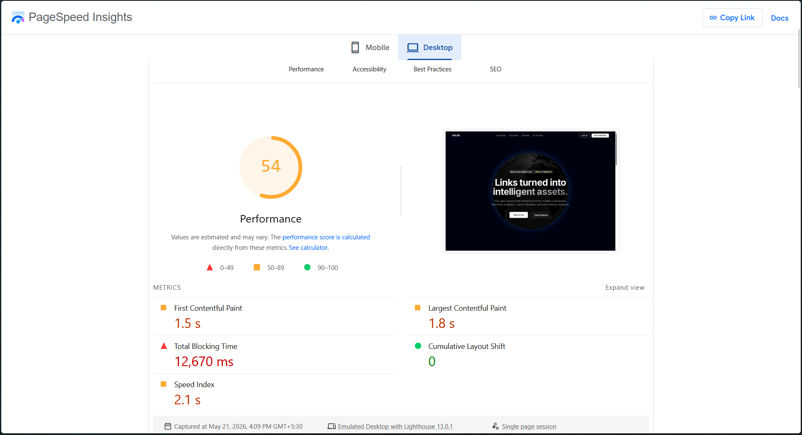
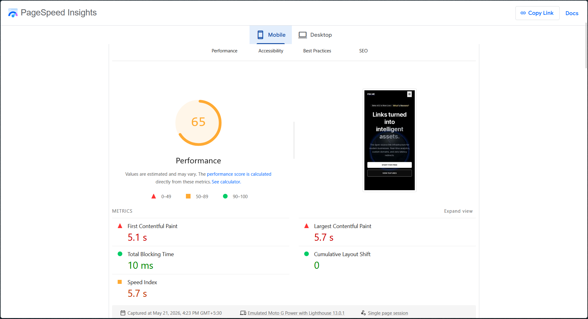
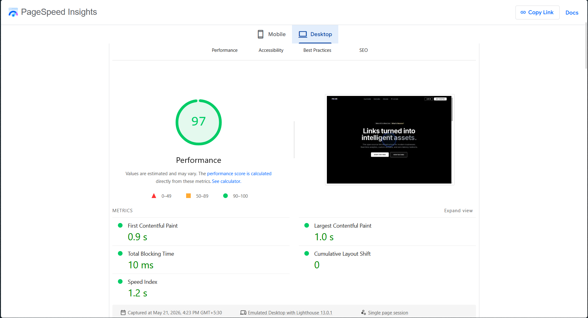
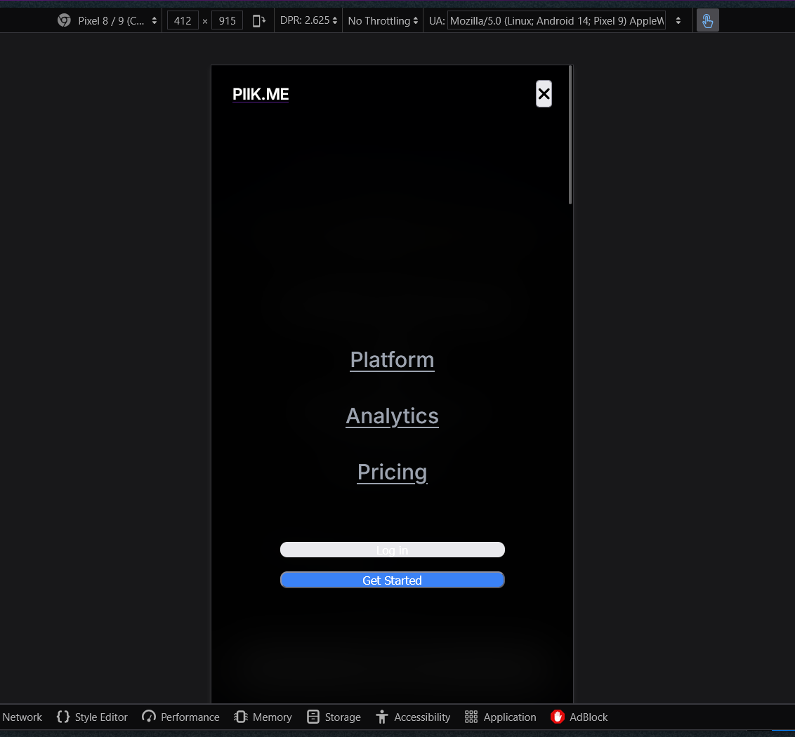
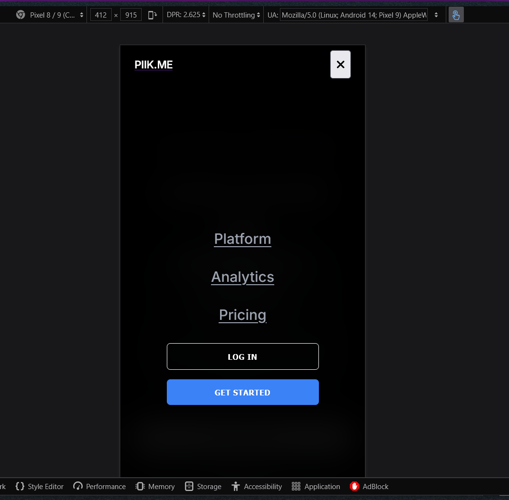

# 🚀 Feature: Landing Page Architecture & Performance Upgrade

## 📋 Overview
This Pull Request introduces major architectural upgrades to the Piik.me landing page. The primary engineering goals for this update were to achieve a near-perfect Lighthouse Performance Score, eliminate main-thread blocking, and implement a custom, GPU-accelerated 3D globe visualization for a premium user experience—all without relying on heavy wrappers.

## 🛠️ Major Architectural Upgrades

### 1. 🧵 Off-Main-Thread 3D Rendering (Web Workers)
* **Removed Heavy Wrappers:** Dropped the `Globe.gl` wrapper library to gain low-level, native control over Three.js.
* **Implemented `OffscreenCanvas`:** Shifted the entire Three.js scene, globe rendering, and animation loop into a background Web Worker (`globe-worker.js`).
* **Impact:** The browser's main thread is now completely free to handle user scrolling, button clicks, and DOM updates, drastically reducing Total Blocking Time (TBT).

### 2. 🌠 Custom GPU Shaders (The Comet Effect)
* **Replaced CPU Lines with GPU Shaders:** Instead of calculating comet tail fades on the CPU, we wrote custom Vertex and Fragment `ShaderMaterial` programs.
* **Exponential Fade Math:** Utilized `pow(opacity, 1.5)` inside the fragment shader to create a realistic, video-matching comet effect with a bright head and a smoothly fading tail.
* **Mobile-Aware Geometry:** The worker automatically detects screen width. Mobile devices receive a highly optimized globe geometry (48 segments) and an adjusted FOV, preventing device overheating and frame drops while maintaining a premium look.

### 3. ⚡ Zero-Dependency UI Animations
* **Stripped Third-Party Animation Libraries:** Removed over ~100kb of JavaScript payload by eliminating GreenSock (GSAP) and ScrollTrigger.
* **Native CSS Replacement:** Replaced heavy scroll reveals with native CSS keyframes (`animate-fade-in-up`) and intersection-based timing.
* **Impact:** Significantly reduced "Unused JavaScript" and improved the Largest Contentful Paint (LCP) timing.

### 4. 🛜 Network Optimization
* **Vercel Analytics Lazy Loading:** Wrapped the Vercel Analytics injection in a `window.addEventListener('load')` event. This prevents the analytics script from blocking the initial critical page render.
* **Icon Resilience:** Optimized FontAwesome loading with `crossorigin` and `referrerpolicy` to prevent aggressive AdBlockers from breaking UI icons.

### 5. ♿ Accessibility (a11y) & Contrast Mastery
* **Viewport Zooming:** Removed `user-scalable=no` to allow users with low vision to magnify the page content safely.
* **Semantic Landmarks:** Wrapped the core visual sections in a semantic `<main>` tag for full screen-reader compliance.
* **Perfect Contrast Ratios:** Adjusted text colors on the Mobile Menu buttons (`simple-btn-primary`) and Footer text (`text-gray-400`) to easily pass Lighthouse contrast audits for maximum readability.

---

## 📊 Performance Metrics & Visual Proof

<b>1. TBT (Total Blocking Time) Improvements</b>

**Before:**

**After:**

<b>2. Mobile Viewport Enhancements</b>

**Before:**

**After:**

